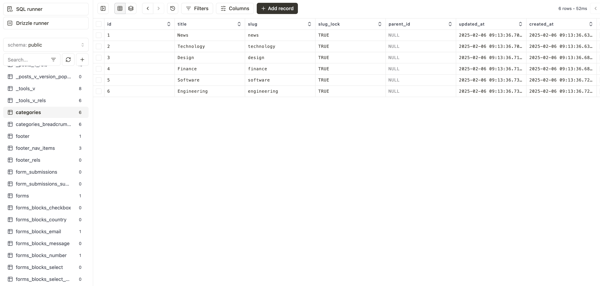

# Using Drizzle Studio with Payload CMS

This guide explains how to set up and use Drizzle Studio to visualize and manage your Payload CMS PostgreSQL database.

## Prerequisites

- A Payload CMS project using PostgreSQL
- Node.js and pnpm installed
- PostgreSQL database running locally or remotely

## Setup Steps

1. Create a new Payload CMS project:
   ```bash
   npx create-payload-app
   ```
   This will generate a project configured with PostgreSQL. The database connection is managed through the `DATABASE_URI` environment variable.

2. Generate the Drizzle schema:
   ```bash
   pnpm payload generate:db-schema
   ```
   This command generates a Drizzle schema file at `src/payload-generated-schema.ts`, which we'll use to connect Drizzle Studio to your database.

3. Install Drizzle Kit as a development dependency:
   ```bash
   pnpm add -D drizzle-kit@0.28.0
   ```
   > **Note:** It's recommended to use the same version as specified in [Payload's package.json](https://github.com/payloadcms/payload/blob/main/packages/db-postgres/package.json#L80) to ensure compatibility.

4. Create a `drizzle.config.ts` file in your project root:
   ```typescript
   import { defineConfig } from "drizzle-kit";

   export default defineConfig({
     dialect: "postgresql",
     dbCredentials: {
       url: process.env.DATABASE_URI!
     },
     schema: "./src/payload-generated-schema.ts"
   });
   ```
   This configuration file tells Drizzle Studio how to connect to your database and where to find the schema.

5. Launch Drizzle Studio:
   ```bash
   pnpm drizzle-kit studio --verbose
   ```
   This will start the Drizzle Studio interface on a local port (usually https://local.drizzle.studio/).

## Result

Once completed, you'll have access to the Drizzle Studio interface where you can:
- View your database schema
- Browse and edit table data
- Execute custom SQL queries
- Monitor database changes



## Troubleshooting

- Make sure your `DATABASE_URI` environment variable is properly set
- Verify that your PostgreSQL database is running and accessible
- Check that the schema file was generated correctly at `src/payload-generated-schema.ts`

## Additional Resources

- [Payload CMS PostgreSQL Documentation](https://payloadcms.com/docs/database/postgres)
- [Drizzle Documentation](https://orm.drizzle.team)
- [Drizzle Studio Documentation](https://orm.drizzle.team/drizzle-studio/overview)

## License

This guide is MIT licensed. Feel free to use it in your projects.
